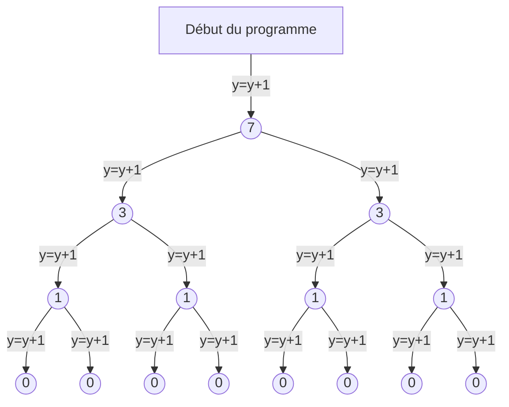
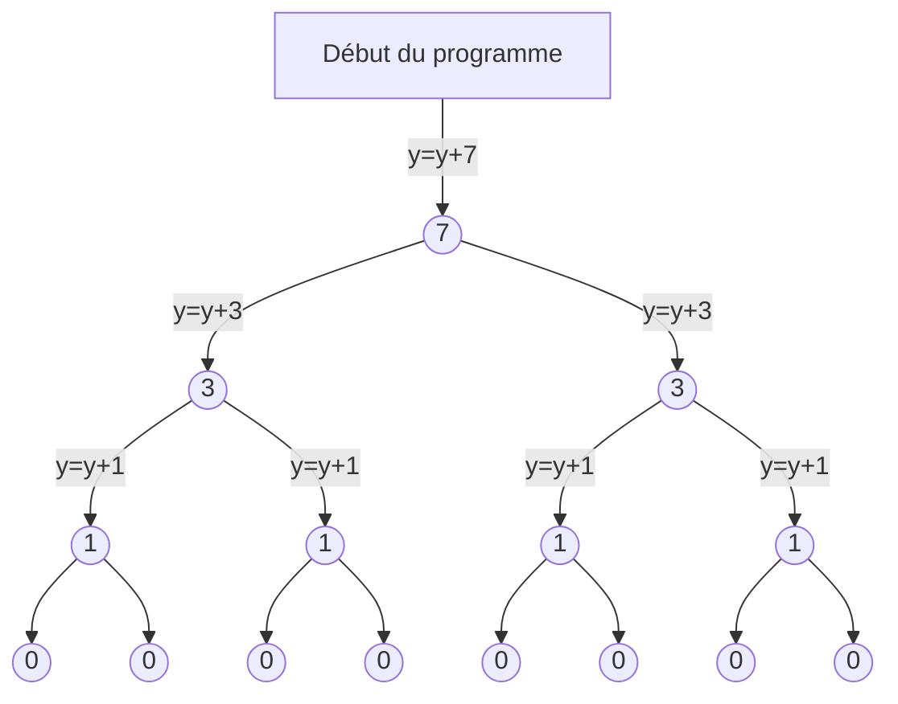

# Chapitre 1 : Logarithmes & Algorithmes

### Rappels

Soient $u,v \in \mathbb{N}$ et $b > 1 \in \mathbb{R}$
 
- $x = b^u \iff x = b.b....b$ (u fois)
- $x = b^\frac{1}{v} \iff x . x .... x$ (v fois) $= b$
- $x = b^\frac{u}{v} \iff x.x.x....x$ (v fois) $= b.b.b....b$ (u fois)
	       $\iff log_b(x) = \frac{u}{v}$

### Exemples d'utilisation

#### Fonction 1
```python
y = 0
def f(x):
    global y
    if x > 0:
        f(x//2)
        f(x//2)
    else:
        y = y + 1
```

Notons $l(x)$ la fonction qui au nombre d'exécution de la fonction associe la profondeur de l'arbre, et $p(x)$ sa fonction inverse.
On a :
- $p(x+y) = p(x)p(y)$
- $l(xy)=l(x)l(y)$
On a en fait:
- $p = \lfloor log_2(x) \rfloor \iff 2^p \leq x \leq 2^{p+1}$ avec $p \in \mathbb{N^*}$

Après l'appel à `f(x)` on a $y = 2^{\lfloor log_2 x \rfloor + 1}$

Preuve
Il suffit de montrer que $y=2^{p+1}$ avec $2^p \leq x \leq 2^{p+1}$ où p est l'unique entier satisfaisant ces inégalités.

$p=0$, $x \in [1,2[$ alors $y=2=2^{p+1}$
$p=1$, $x \in [2,4[$ alors $y=4=2^{p+1}$
$p=2$, $x \in [4,8[$ alors $y=8=2^{p+1}$

Supposons $y=2^{p+1}$ avec $x \in [2^p,2^{p+1}[$
Alors $y=2.2^{p+1}$ avec $x \in [2^{p+1}, 2^{p+2}[$

#### Fonction 2

```python
y = 0
def g(x):
    global y
    if x > 0:
        g(x//2)
        g(x//2)
        y = y + 1
```




Après l'appel à `g(x)` on a $y = 2^{\lfloor log_2 x \rfloor + 1}-1$

Preuve
Il suffit de montrer que $y=2^{p+1}-1$ avec $2^p \leq x \leq 2^{p+1}$ où p est l'unique entier satisfaisant ces inégalités.

$p=0$, $x \in [1,2[$ alors $y=1=2^{p+1}-1$
$p=1$, $x \in [2,4[$ alors $y=3=2^{p+1}-1$
$p=2$, $x \in [4,8[$ alors $y=7=2^{p+1}-1$

Supposons $y=2^{p+1}-1$ avec $x \in [2^p,2^{p+1}[$
Alors $y=2(2^{p+1}-1)+1=2^{(p+1)+1}-1=2^{p+2}-1$ avec $x \in [2^{p+1}, 2^{p+2}[$


#### Fonction 3

```python
y = 0
def h(x):
    global y
    if x > 0:
        h(x//2)
        h(x//2)
        y = y + x
```



